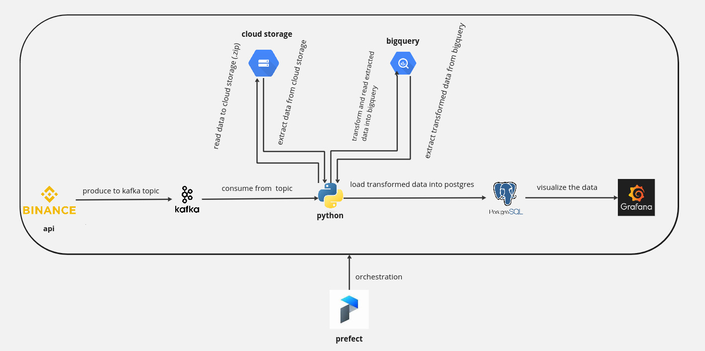

**Binance Market Data Pipeline**

**Introduction**

The Binance Data Pipeline is a real-time data ingestion, transformation, and visualization pipeline for cryptocurrency data. 
This project streams data from the Binance API to Kafka, stores it in Google Cloud Storage, transforms it, loads it into BigQuery, 
and finally stores the processed data in a Cloud SQL PostgreSQL database. 
The data can be visualized using Grafana connected to the PostgreSQL database. 
The pipeline is orchestrated using Prefect.

**Table of Contents**

    Introduction
    Architecture
    Prerequisites
    Installation
    Usage
    Contributing
    FAQ
    License
    Contact

  **Architecture**
  
    +----------------+        +---------+       +------------------------+
    |                |        |         |       |                        |
    |  Binance API   +------->+  Kafka  +------->+ Google Cloud Storage  |
    |                |        |         |       |        (GCS)           |
    +----------------+        +---------+       +------------------------+
                                                     |
                                                     |
                                                     v
                                           +-----------------+
                                           |                 |
                                           |    Prefect      |
                                           | (Orchestration) |
                                           |                 |
                                           +-----------------+
                                                     |
                                                     |
                         +---------------------------+
                         |                           |             
                         v                           v              
                +----------------+          +--------------------+    
                |                |          |                    |    
                |   Download     |          |  Transform & Load  |    
                |   from GCS     |          |   into BigQuery    |    
                |                |          |                    |     
                +----------------+          +--------------------+     
                                                     |
                                                     |
                                                     v
                                           +---------------------+
                                           |                     |
                                           |  BigQuery           |
                                           |                     |
                                           +---------------------+
                                                     |
                                                     |
                                                     v
                                           +---------------------+
                                           |                     |
                                           |  Cloud SQL          |
                                           |  (PostgreSQL)       |
                                           |                     |
                                           +---------------------+
                                                     |
                                                     |
                                                     v
                                           +---------------------+
                                           |                     |
                                           |     Grafana         |
                                           |   (Visualization)   |
                                           |                     |
                                           +---------------------+

**Data Pipeline Diagram**

**Prerequisites**

    A Google Cloud Platform account
    Python 3.8 or higher
    pip (Python package installer)
    virtualenv (optional but recommended)
    Google Cloud SDK
    Confluent cloud account
    Kafka topic
    Grafana

**Installation**

**Step 1: Clone the Repository**

    git clone https://github.com/your-username/Binance-Market-Data-Pipeline.git
    cd Binance-Market-Data-Pipeline 

**Step 2: Create a Virtual Environment**

    python -m venv env
    source env/bin/activate  # On Windows, use `env\Scripts\activate`

**Step 3: Install the Dependencies**

    pip install -r requirements.txt

**Step 4: Set up Google Cloud Credentials**

Ensure you have the Google Cloud SDK installed and authenticated. Set the 'GOOGLE_APPLICATION_CREDENTIALS' environment variable to the path of your service account key file.

    export GOOGLE_APPLICATION_CREDENTIALS="/path/to/your/service-account-file.json"

**Step 5: Configure Database Settings**

Edit the 'config.ini' file to specify the connection details for your PostgreSQL database.

    [development]
    DB_HOST=<your-db-host>
    DB_PORT=<your-db-port>
    DB_NAME=<your-db-name>
    DB_USER=<your-db-user>
    DB_PASSWORD=<your-db-password>

**Step 6: Deploy Cloud Function**

Deploy the Google Cloud Function to trigger the data transformation when new data is added to the GCS bucket.

    gcloud functions deploy trigger_data_transform \
    --runtime python39 \
    --trigger-topic gcs-notification-topic \
    --entry-point trigger_data_transform \
    --region YOUR_REGION

**Usage**

**Running the Prefect Flow**

Ensure that your Prefect server and agent are running. Then execute the Prefect flow.

    python binance_etl.py

**Viewing Data in Grafana**

1. Connect Grafana to your Cloud SQL PostgreSQL database.
2. Create dashboards and panels to visualize the data.

**Contributors**

Israel Owusu Ansah (israel@trestleacademyghana.org)

Nathaniel Yeboah Frimpong (nat@trestleacademyghana.org)

**FAQ**

**How do I monitor the Prefect tasks?**
You can monitor the Prefect tasks on the Prefect UI. Start the Prefect server and agent, then access the UI at http://localhost:4200.
